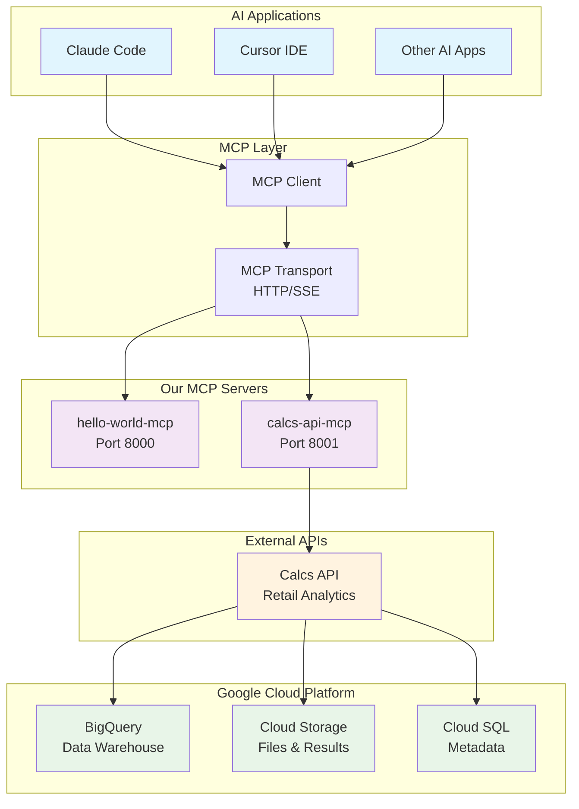

# MCP Servers

A collection of Model Context Protocol (MCP) servers that provide Claude Code, Cursor, and other AI applications with specialized functionality for various development and analytics tasks.

## How MCP Servers Work

The Model Context Protocol (MCP) enables AI applications to securely connect to external systems and data sources through standardized server interfaces. This architecture allows AI assistants to perform real-world tasks while maintaining security and user control.



### Architecture Flow

1. **AI Applications** (Claude Code, Cursor) make requests for specific capabilities
2. **MCP Client** translates requests into MCP protocol messages
3. **MCP Transport** carries messages over HTTP with Server-Sent Events (SSE)
4. **MCP Servers** receive requests and execute business logic
5. **External APIs** (like Calcs API) provide domain-specific functionality
6. **Cloud Resources** store and process data, returning results through the chain

### Benefits

- **Security**: MCP servers act as controlled gateways to sensitive systems
- **Standardization**: Consistent interface across different AI applications  
- **Modularity**: Each server provides focused functionality
- **Scalability**: Servers can be deployed independently and load-balanced
- **Auditability**: All requests flow through logged, traceable channels

## Current Servers

### hello-world-mcp
A simple demonstration MCP server in Python that showcases basic MCP functionality with two tools:
- `say_hello` - Returns a friendly greeting message
- `get_random_fact` - Returns random fun facts

**Location**: `hello-world-mcp/`
**Port**: 8000
**Documentation**: See individual server README in `hello-world-mcp/README.md`

### calcs-api-mcp
MCP server that provides access to the Calcs API for retail analytics calculations and test management. Acts as a bridge between Claude and the Calcs API, offering comprehensive tools for managing A/B tests, analyses, and retrieving retail analytics data.

**Location**: `calcs-api-mcp/`
**Port**: 8001
**Documentation**: See individual server README in `calcs-api-mcp/README.md`

## Quick Start

### Prerequisites
- Python 3.10 or higher
- UV package manager (recommended) or pip
- Claude Code CLI

### Installation

Each server can be installed and run independently:

```bash
# Install hello-world-mcp
cd hello-world-mcp
uv sync

# Install calcs-api-mcp
cd ../calcs-api-mcp
uv sync
```

### Running Servers

Start each server in its own terminal:

```bash
# Terminal 1: Start hello-world server (port 8000)
cd hello-world-mcp
uv run hello_world_mcp/server.py

# Terminal 2: Start calcs-api server (port 8001)
cd calcs-api-mcp
uv run calcs_api/server.py
```

### Connecting to Claude Code

Add servers using Claude Code CLI commands:

```bash
# Add hello-world-mcp server
claude mcp add --transport sse hello-world-mcp http://localhost:8000/messages

# Add calcs-api-mcp server (requires environment variables)
claude mcp add --transport sse calcs-api-mcp http://localhost:8001/messages

# Start Claude Code with MCP servers
claude
```

### Connecting to Cursor

Add servers to your Cursor settings by opening Cursor settings (Cmd/Ctrl + ,) and adding:

```json
{
  "mcpServers": {      
    "hello-world-mcp": {
      "url": "http://localhost:8000/messages"
    },
    "calcs-api-mcp": {
      "url": "http://localhost:8001/messages"
    }
  }
}
```

## Repository Structure

```
mcp-servers/
├── README.md                    # This file
├── CLAUDE.md                   # Claude Code guidance
├── hello-world-mcp/            # Simple demo MCP server (Python/UV)
│   ├── README.md
│   ├── pyproject.toml
│   ├── hello_world_mcp/
│   └── claude-code-config.json
├── calcs-api-mcp/              # Calcs API MCP server (Python/UV)
│   ├── README.md
│   ├── pyproject.toml
│   ├── calcs_api/
│   └── claude-code-config.json
└── [future-server]/            # Additional servers go here
```

## Adding New Servers

To add a new MCP server to this repository:

1. **Create a new directory** for your server (e.g., `my-new-server/`)

2. **Initialize the server** with UV and pyproject.toml:
   ```bash
   mkdir my-new-server
   cd my-new-server
   uv init --package
   ```

3. **Set up MCP dependencies** in `pyproject.toml`:
   ```toml
   [project]
   name = "my-new-server"
   version = "0.1.0"
   requires-python = ">=3.10"
   dependencies = [
       "mcp>=1.0.0",
       "fastapi>=0.100.0",
       "uvicorn>=0.20.0",
   ]

   [project.scripts]
   my-new-server = "my_new_server.server:run"
   ```

4. **Follow MCP server conventions**:
   - Use SSE transport for HTTP connectivity
   - Entry point should expose a `run()` function
   - Use Python 3.10+ compatible code
   - Choose a unique port number

5. **Create configuration examples**:
   ```bash
   # Create claude-code-config.json
   echo '{
     "mcpServers": {
       "my-new-server": {
         "transport": {
           "type": "sse",
           "url": "http://localhost:PORT/messages"
         }
       }
     }
   }' > claude-code-config.json
   ```

6. **Update this README** to document your new server

## Managing MCP Servers

### List configured servers:
```bash
claude mcp list
```

### Remove a server:
```bash
claude mcp remove hello-world-mcp
```

### Check server status:
Check if servers are running by visiting their health endpoints:
- hello-world-mcp: http://localhost:8000/messages
- calcs-api-mcp: http://localhost:8001/messages

## Environment Configuration

### calcs-api-mcp Environment Setup
The calcs-api-mcp server requires environment variables:

```bash
cd calcs-api-mcp
cp .env.example .env  # If available
# Edit .env with your actual API tokens:
# CALCS_API_TOKEN=your_token_here
# CALCS_API_BASE_URL=https://your-api-url.com
# CALCS_DEFAULT_CLIENT=your_client_id
```

### hello-world-mcp
No environment configuration required - runs out of the box.

## Development Guidelines

- Each server should be self-contained in its own directory
- Use Python with UV for dependency management
- Use HTTP/SSE transport for Claude Code/Cursor compatibility
- Include comprehensive documentation in each server's README
- Add configuration examples for easy setup
- Follow MCP protocol specifications
- Choose unique port numbers to avoid conflicts

## Troubleshooting

### Server won't start
- Check if the port is already in use: `lsof -i :8000`
- Verify dependencies are installed: `uv sync`
- Check environment variables for calcs-api

### Claude Code can't connect
- Verify server is running and accessible
- Check port numbers match configuration
- Use `claude mcp list` to see configured servers

### Cursor can't connect
- Ensure absolute URLs in configuration
- Check that Cursor has MCP support enabled
- Verify server URLs are accessible

## License

MIT
